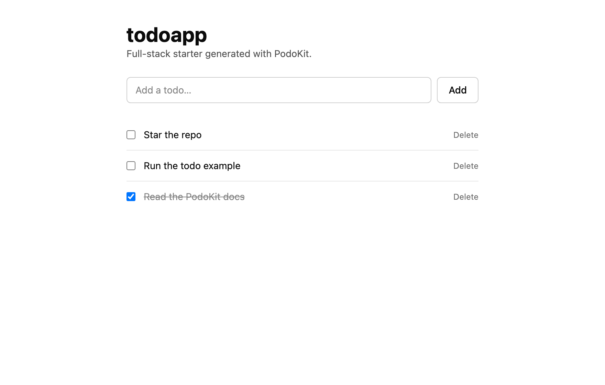
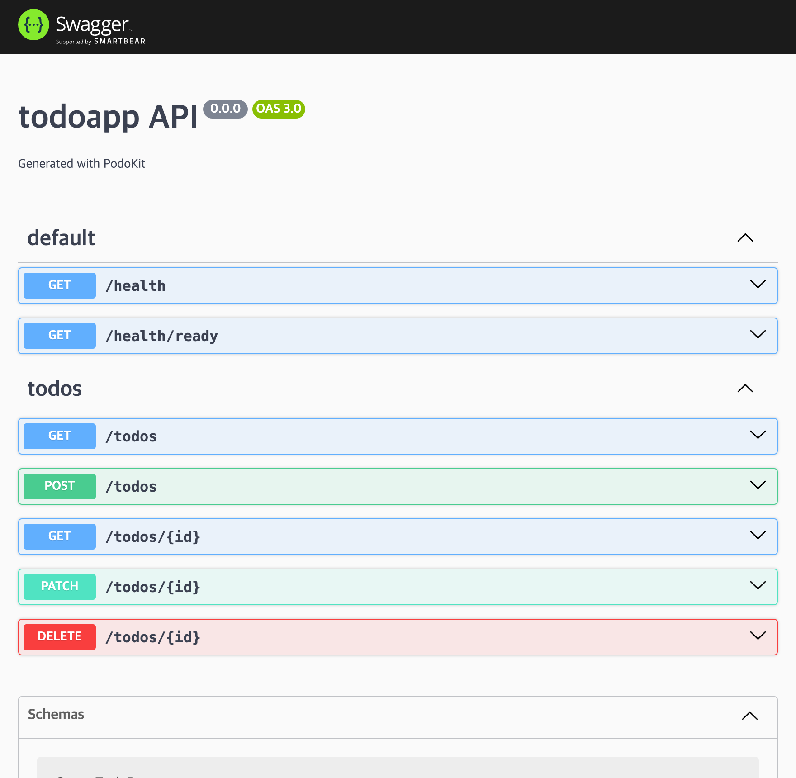

# PodoKit

PodoKit is an opinionated but extensible starter toolkit and CLI for building full-stack TypeScript applications with **NestJS**, **SvelteKit**, **TailwindCSS**, **shadcn-svelte**, **Docker**, and **k3s**.

## Why PodoKit?

Modern full-stack projects repeat the same setup work: backend structure, frontend structure, shared TypeScript configuration, environment variables, Docker Compose, k3s manifests, health checks, and CI. PodoKit gives you a consistent, production-minded foundation so you can start building features instead of plumbing.

## Quick start

```bash
npx @podosoft/podokit create my-app
cd my-app
npm install
cp .env.example .env
npx @podosoft/podokit dev watch
```

Open **http://my-app.localhost**. The first running project starts one user-level
Traefik gateway on loopback port 80; additional projects reuse it and route by
their own `*.localhost` hostname. Stop this project with
`npx @podosoft/podokit dev down`. See [Development](docs/development.md) for
profiles, migrations, lifecycle commands, and the alternative host-process loop.

## CLI

```
podo create <name> [options]

Options:
  --template <t>   fullstack-nest-svelte (default) | todo | base
  --dir <path>     Target directory (default: ./<name>)
  --pm <name>      npm (default) | pnpm | yarn
  -y, --yes        Skip prompts and accept defaults
  -h, --help       Show help
```

Run without flags in a terminal and PodoKit prompts for the template and package manager.

| Command | What it does |
|---|---|
| `podo create <name>` | Scaffold a new project from a template |
| `podo add <module>` | Add a feature module (auth, admin-dashboard, redis, …) |
| `podo remove <module>` | Un-apply a module (inverse of add; keeps your edits) |
| `podo status` | Version, modules, file tiers, and local edits |
| `podo diff` | Managed files you've edited since generation |
| `podo doctor` | Framework versions vs. supported ranges |
| `podo locale <command>` | Add, validate, activate, deactivate, or list JSON locales |
| `podo update [--apply]` | Preview or apply a version update (3-way merges your edits) |
| `podo eject <path…>` | Take ownership of a managed file |
| `podo dev <action>` | Run container development through the shared portless `*.localhost` gateway (`npx @podosoft/podokit dev …` without a global install) |

## Templates

| Template | Description |
| --- | --- |
| `fullstack-nest-svelte` (default) | Clean NestJS + SvelteKit starter: config validation, health checks, Swagger, TypeORM wired (no domain code) + Docker Compose and k3s |
| `todo` | The fullstack starter plus a Todo CRUD example (DB entity, migration, UI) — a runnable reference |
| `base` | Minimal npm workspace to build up from scratch |

Pick one interactively, or pass `--template <name>`:

```bash
npx @podosoft/podokit create my-app                    # clean fullstack (default)
npx @podosoft/podokit create my-app --template todo    # worked todo example
npx @podosoft/podokit create my-app --template base    # minimal
```

### Preview — the `todo` template

`--template todo` generates a working todo app (SvelteKit UI + NestJS API + PostgreSQL) with API docs:

| Web (SvelteKit) | API docs (Swagger) |
| --- | --- |
|  |  |

### What the fullstack starter gives you

```
my-app/
├── apps/
│   ├── api/     # NestJS: zod env validation, /health + /health/ready,
│   │            # Swagger at /api-docs, TypeORM wired (add your entities),
│   │            # global ValidationPipe, standard { success, error } envelope
│   └── web/     # SvelteKit: Tailwind v4, shadcn-svelte, typesafe-i18n,
│                # server-side API proxy (browser never calls the API directly)
├── infra/
│   ├── docker/  # docker-compose: PostgreSQL, Redis (healthchecks)
│   └── k3s/     # namespace, deployments, service, ingress, secret example
├── .env.example
├── package.json # npm workspace
└── README.md
```

## Repository layout

This repo is an npm workspace. Published packages:

- `packages/cli` — the `@podosoft/podokit` CLI (`podo`)
- `packages/template-engine` — `@podosoft/podokit-template-engine`: token rendering, in-memory assembly, fenced-region wiring, and 3-way merge
- `packages/api-client` — `@podosoft/podokit-api-client`: typed API client the generated frontend uses (better-auth + error-envelope request layer)
- `packages/contracts` — `@podosoft/podokit-contracts`: the `Capabilities`, error envelope, and `AppException` shared by backend and frontend
- `packages/podokit-auth` — `@podosoft/podokit-auth`: the DB-backed auth configuration pipeline (encrypted secrets, config store)
- `packages/podokit-module-blog` — `@podosoft/podokit-module-blog`: draft-first publishing, visibility controls, image uploads, comments, ownership, and admin management as an external updateable module
- `templates/` — project templates copied by the CLI
- `examples/` — how to generate example apps

```bash
npm install
npm run build
npm run lint
npm test
```

## Status

PodoKit is early (`0.x`). The CLI and templates work end-to-end, but APIs and templates may change before `1.0`. Feedback and issues are welcome.

## Add features with modules

Grow a project feature by feature without swapping templates:

```bash
cd my-app
npx @podosoft/podokit add auth      # full auth (better-auth): email/password, sessions, OAuth, 2FA
```

`podo add` overlays files, merges dependencies, appends env vars, and wires the
module into the NestJS app. See [docs/modules.md](docs/modules.md).

External package modules use the same workflow after installation. For example:

```bash
npm install --save-dev @podosoft/podokit-module-blog
podo add blog
```

The **`admin-dashboard`** module adds a full admin console on top of `auth`:
user & session management, an audit log, and a Settings page where OAuth
providers, SMTP, provider-independent sign-up approval, automatic logout, and server toggles are
configured at runtime (encrypted in the DB, applied without a restart). Pending
registrations are approved from `/admin/users`, and the generated
`admin:bootstrap` command creates or verifies the first administrator without
using the public sign-up page. The separate `auth:configure` command automates
applying provider/SMTP credentials. Both workflows keep passwords and provider
secrets out of source files and logs; see [the module guide](docs/modules.md#admin-dashboard).


## Keep your project up to date

Every generated project records how it was assembled in a committed `.podokit/`
directory (template, modules, and a per-file ownership tier), so it can receive
template and module improvements later without losing your work:

```bash
podo status          # version, modules, and which managed files you've edited
podo update          # preview what a newer PodoKit version would change
podo update --apply  # apply it — clean updates written, your edits 3-way merged
```

Files you own (routes, your components, shadcn UI) are never touched. See
[docs/updating.md](docs/updating.md).

## AI coding agents

Generated projects come ready for AI coding tools. `podo create` writes an
[`AGENTS.md`](https://agents.md) — the open standard read by Codex, Cursor,
Copilot, Gemini, and more — describing the stack, commands (web :5001 / api
:5002), code style (Svelte 5 runes, shadcn-svelte + shared `DataTable`, the
error-code envelope), and the `podo` tooling. `CLAUDE.md` imports it
(`@AGENTS.md`) for Claude Code, with thin `.cursor/rules` and
`.github/copilot-instructions.md` pointers included too. Claude Code **skills**
(`.claude/skills/`) add procedural know-how (scaffolding a NestJS endpoint or a
SvelteKit route, using the DataTable, running `podo add`/`podo update`, and safely
configuring Google/Apple OAuth plus SMTP); modules
extend `AGENTS.md` with their own conventions as you add them. Skip it all with
`podo create --no-ai`.

Projects also ship a `.mcp.json` wiring up the **PodoKit MCP server**
([`@podosoft/podokit-mcp`](packages/mcp/README.md)) — run locally via `npx`, no
hosting — so agents can list/add modules, check project status, preview updates,
and search the docs. And you can point any MCP-capable tool at the docs remotely
with **GitMCP** (no install): register the URL
`https://gitmcp.io/podosoft-dev/podokit`, e.g. for Cursor/Claude Code:

```json
{ "mcpServers": { "podokit-docs": { "url": "https://gitmcp.io/podosoft-dev/podokit" } } }
```

A repo-root [`llms.txt`](llms.txt) gives LLMs a curated index of these docs.

### Start a project from scratch with an AI agent

Register the MCP server **globally** so it's available before any project exists:

```bash
claude mcp add --scope user podokit -- npx -y @podosoft/podokit-mcp
# Cursor/Codex: add the same command in their MCP settings
```

Then, in an empty folder, tell your agent:

> "Create a fullstack PodoKit app called **blog** with auth and admin-dashboard."

It calls `list_templates` → `create_project` → `add_module` and runs
`npm install` — from nothing to a running starter in one prompt, with the
conventions already loaded from `AGENTS.md`.

## Documentation

- [Getting Started](docs/getting-started.md)
- [Templates](docs/templates.md)
- [Modules (`podo add`)](docs/modules.md)
- [Localization and JSON catalogs](docs/localization.md)
- [Updating a project (`podo update`)](docs/updating.md)
- [Examples](examples/README.md)
- [Development](docs/development.md) · [Testing](docs/testing.md)
- [Reporting a bug](docs/reporting-bugs.md)
- [Changelog](CHANGELOG.md)

## Contributing

See [CONTRIBUTING.md](CONTRIBUTING.md) and [CODE_OF_CONDUCT.md](CODE_OF_CONDUCT.md).

**Found a bug?** See [how to report a bug](docs/reporting-bugs.md) — a person or an
AI coding agent can file one straight from the terminal with `gh`.

## Security

See [SECURITY.md](SECURITY.md) for how to report vulnerabilities.

## License

[Apache-2.0](LICENSE)
