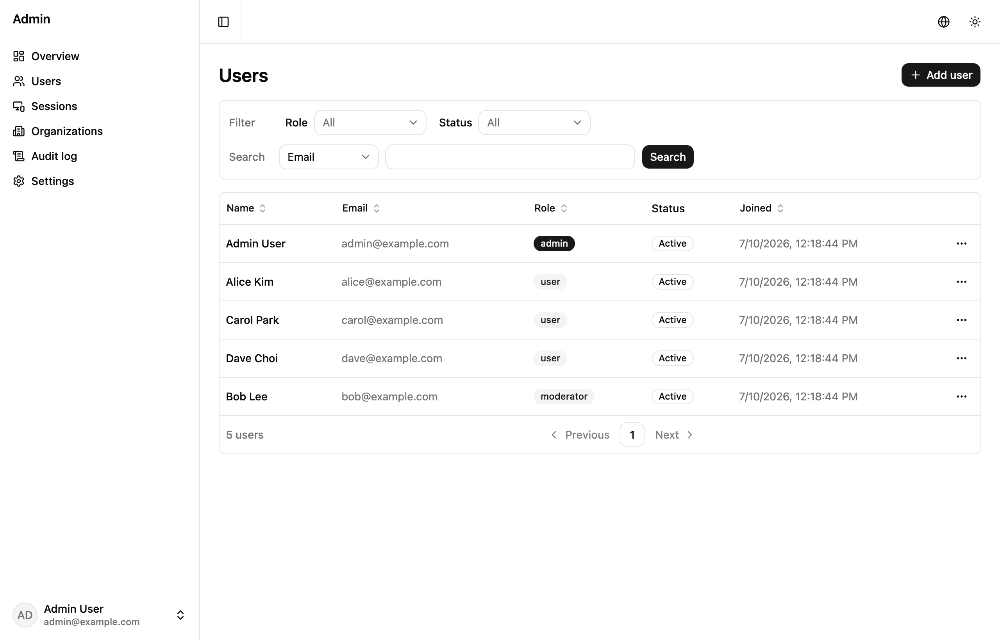
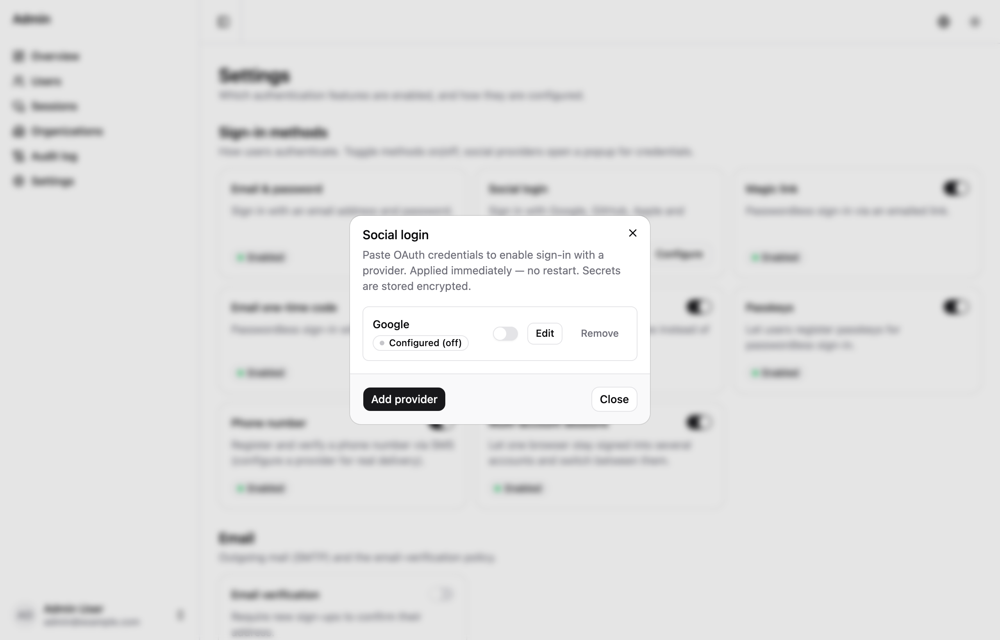

# Modules (`podo add`)

Add composable features to an existing generated project without duplicating a
whole template. Run inside a project created by `podo create`:

```bash
cd my-app
npx @podosoft/podokit add <module>
```

`podo add` (with no module) lists what's available. Modules can depend on other modules — required modules are added automatically. Each module:

- overlays its files into the project,
- merges its dependencies into the target app's `package.json`,
- appends any environment variables to `.env.example`,
- wires itself into `app.module.ts` at marker comments,
- may declare `ownedGlobs` (paths it ships as user-owned — e.g. public pages you
  restyle — merged into your project so `podo update` never touches them; see
  [updating](updating.md#module-owned-paths)),
- may declare `managedOverrides` for module-owned files inside a broadly owned
  area, such as a generated `.claude/skills/<module>/**` workflow that must keep
  receiving updates, and
- prints follow-up steps.

## Available modules

### External package modules

PodoKit can load a module from an installed package named
`@podosoft/podokit-module-<name>`. Install the package in the generated project's
root, then add it by its short name:

```bash
npm install --save-dev @podosoft/podokit-module-blog
podo add blog
```

The project manifest records the package name and applied version. After
upgrading the package, `podo update` resolves it from the generated project's
`node_modules` and previews its managed-file changes. Public presentation routes
can remain app-owned while reusable API and `$lib` paths continue to update.

If an application already has the same feature and the package declares explicit
`managedGlobs`, use `--adopt` to hand only those paths back to the module. Existing
owned presentation paths are preserved:

```bash
podo add blog --adopt
```

### `blog` (external package)

Authenticated Markdown publishing with image attachments, paginated public posts,
flat comments, author ownership, and admin management. Regular users publish immediately and can
edit or delete only their own posts and comments; admins can manage all content.

```bash
npm install --save-dev @podosoft/podokit-module-blog
podo add blog
npm install
npm run migration:run -w <app>-api
```

The module keeps `apps/api/src/blog/**`, reusable `$lib/blog/**`, and its tests
managed. Public `/blog` route wrappers and `/admin/blog` presentation files are
owned so applications can implement their own design and SEO. The additive
migration preserves an existing `blog_posts` table, adds author snapshots and
ownership, and creates comments with post-cascade deletion.

Use the managed `BlogProse` component in an application-owned article route. It
shares a safe GFM renderer with `BlogEditor`, keeping preview and published body
markup and typography consistent while the surrounding article layout stays
application-owned.

`BlogEditor` uploads PNG, JPEG, GIF, WebP, and AVIF files up to 5 MB to object
storage, then inserts a Markdown image at the current cursor. The resulting
`/api/blog/images/:id` URL is public, stable, and cacheable, unlike a presigned
file-upload URL. SVG is excluded from inline blog uploads.

### `auth` (better-auth)

Full authentication built on [better-auth](https://better-auth.com): email/password
and sessions out of the box, plus **OAuth** and **2FA** enabled by configuration.
Adding it installs a **global auth guard**, so the API is **secure by default** —
every route requires a session except `/health` and `/api/auth/*`. Opt routes out
with `@Public()`; read the current user with `@Session()`.

```bash
npx @podosoft/podokit add auth
npm install
# create the auth tables (user/session/account/verification)
npx @better-auth/cli migrate -y --config apps/api/src/auth/auth.ts
npm run dev

# sign up (sets a session cookie), then call a protected route
curl -c cookies.txt -XPOST localhost:5002/api/auth/sign-up/email \
  -H 'content-type: application/json' -d '{"email":"a@example.com","password":"password123","name":"A"}'
curl -b cookies.txt localhost:5002/account/me
```

For a built production image, run both the Better Auth schema migration and all
TypeORM migrations without downloading a CLI or copying TypeScript source into
the image:

```bash
npm run migrate:all -w <app>-api
```

The command uses `dist/migrate.js`, exits non-zero on failure, and is suitable
for a Kubernetes migration Job before a rolling deployment.

- **Secure by default**: all module endpoints (jobs, storage, files, cache, …) are protected once `auth` is added.
- **Configure it in the admin Settings page, not env.** Social OAuth providers, SMTP, the
  server-enforced toggles (email verification, sign-up approval, breached-password check, account deletion, and —
  with the audit-log module — audit logging), and the feature flags (2FA, magic link, email OTP,
  username, multi-session, phone number, …) are all stored in the DB and **applied live — no
  restart** (paste a client id/secret and social login works on the next request). Only
  `BETTER_AUTH_SECRET` and `BETTER_AUTH_URL` are required env vars; the rest are optional
  fallbacks/overrides that the DB config takes precedence over (handy for secrets-manager
  injection in production).
- **Social login is dynamic.** The "Social login" card manages providers add/edit/delete: pick
  any better-auth-supported provider (Google, GitHub, Apple, Microsoft, Discord, Kakao, Naver,
  … — see `auth/auth-config.ts` `SUPPORTED_SOCIAL_PROVIDERS`), paste its client id/secret, and it
  takes effect on the next request. Each provider is one `social.<id>` row in `auth_config`;
  removing it deletes the row. `GOOGLE_CLIENT_*` / `GITHUB_CLIENT_*` env vars still seed those two
  as a fallback. Enabled providers appear automatically on `/login`; OAuth failures return to the
  login origin through `errorCallbackURL`.
- **Sign-up approval is provider-independent.** Turn on *Sign-up approval* in Settings to mark
  every new self-registered account as pending, whether it came from email/password, Google,
  Apple, magic link, or another provider. Pending accounts cannot create a session and receive the
  stable `SIGNUP_APPROVAL_REQUIRED` code. Existing users, `ADMIN_EMAILS`, and users created by an
  administrator remain approved. Turning the policy off auto-approves future registrations; it
  does not silently approve the existing queue. Approve those users from `/admin/users`.
- **Closing public sign-up is provider-independent.** Turn off *Allow public sign-up* under
  Settings → General to reject every new self-registration path with the stable
  `PUBLIC_SIGNUP_DISABLED` code. Email, Google, Apple, magic-link, and future providers all use
  the same new-user database gate. Existing users can still sign in with any enabled method, and
  administrators can still create users deliberately from `/admin/users`.
- **Use a stable HTTPS origin for development OAuth.** Keep portless `*.localhost` for normal
  multi-app work, then expose the web container through a Cloudflare Named Tunnel, reserved ngrok
  domain, or preview deployment for provider callbacks. Register the exact HTTPS origin and
  `/api/auth/callback/google`, and use a separate Google Cloud project/client for development.
  Admin Settings persists the displayed callback when the provider is saved, and `auth:configure`
  derives and persists it from `AUTH_SETUP_ORIGIN` unless `OAUTH_REDIRECT_URI` explicitly overrides
  it. Use `--redirect-only` to repair a stale callback while preserving the stored credentials and
  enabled state. See [OAuth development over HTTPS](oauth-development.md).
- **Automate provider and SMTP configuration.** Generated APIs include a redacting admin-API
  helper. Pass secrets through environment variables, never command arguments:

  ```bash
  export AUTH_SETUP_ORIGIN="https://example.com"
  export AUTH_SETUP_ADMIN_EMAIL="admin@example.com"
  export AUTH_SETUP_ADMIN_PASSWORD="<from-secret-manager>"
  export OAUTH_CLIENT_ID="<provider-client-id>"
  export OAUTH_CLIENT_SECRET="<from-secret-manager>"
  npm run auth:configure -w <app>-api -- --provider google --require-signup-approval --dry-run
  npm run auth:configure -w <app>-api -- --provider google --require-signup-approval
  npm run auth:configure -w <app>-api -- --provider google --check-only
  ```

  The generated `.claude/skills/podokit-configure-auth` skill contains Google, Apple, SMTP relay,
  secret-handling, callback, and verification workflows.
- **Secrets are encrypted at rest**: OAuth client secrets and the SMTP password are stored with
  AES-256-GCM, the key derived from `BETTER_AUTH_SECRET` (never in the DB it protects). They are
  never returned to the browser (the API exposes only a `hasSecret` flag). Keep
  `BETTER_AUTH_SECRET` stable — rotating it makes previously-saved DB secrets undecryptable.
- **Bearer tokens (API/mobile clients)**: always on. Sign-in returns the session token in
  a `set-auth-token` response header; send it back as `Authorization: Bearer <token>` to
  authenticate without a cookie. Useful for native apps and server-to-server calls.

  ```bash
  # grab the token from the sign-in response header, then call a protected route with it
  TOKEN=$(curl -si -XPOST localhost:5002/api/auth/sign-in/email \
    -H 'content-type: application/json' -d '{"email":"a@example.com","password":"password123"}' \
    | awk -F': ' 'tolower($1)=="set-auth-token"{print $2}' | tr -d '\r')
  curl -H "Authorization: Bearer $TOKEN" localhost:5002/account/me
  ```
- **Two-factor with backup codes**: when 2FA is enabled, the login page shows a
  second-factor step with a **"use a backup code"** option, so a user without
  their authenticator can still sign in with a one-time code. The account page
  lets them download the codes and regenerate a fresh set (invalidating the old).
- **Require two-factor** (admin Settings toggle, off by default): forces every
  user to enrol in 2FA before using the app — un-enrolled users are redirected to
  `/setup-2fa`, and the API rejects their requests (`TWO_FACTOR_REQUIRED`, via a
  global guard) until they do. Machine clients (api-key/bearer) are exempt.
- Security/audit modules build on this (they require `auth`).


### `mailer`

Reusable email sending. `auth` (and later `contact-form`) depend on it, so it is
usually added automatically.

```bash
npx @podosoft/podokit add mailer
```

```ts
import { sendMail, actionEmail } from "../mail/mailer"; // path relative to your file
await sendMail({ to: "a@example.com", subject: "Hi", text: "Hello", html: actionEmail(...) });
```

- **SMTP resolution** (applied live, ~3s TTL): admin Settings page (DB, when
  `auth` is installed) → `SMTP_*` env → none, in which case messages are logged
  to the console so dev links stay grabbable.
- Depends on no other module (reads the DB SMTP config defensively), so `auth`
  can require it without a cycle.
- **Override the transport** (e.g. a provider SDK) from the owned DI slot
  `apps/api/src/app.extensions.ts`: `import { setMailTransport } from "./mail/mailer"; setMailTransport(myTransport)`.


### `bullmq`

Background jobs with [BullMQ](https://docs.bullmq.io): a demo queue, enqueue/
status endpoints on the API, and a **separate worker process** that consumes
jobs (the standard production shape — workers scale independently of the API).
Needs Redis.

```bash
npx @podosoft/podokit add bullmq
npm install
docker compose -f infra/docker/docker-compose.yml up -d   # postgres + redis

# terminal 1 — API (producer)
npm run dev
# terminal 2 — worker (consumer)
npm run dev:worker -w my-app-api

curl -XPOST localhost:5002/jobs -H 'content-type: application/json' -d '{"text":"hello"}'
curl localhost:5002/jobs/<id>   # waiting -> active -> completed
```

Without the worker running, jobs stay `waiting`; start the worker and they complete.

**Deployment.** The worker is a separate process, so `podo add bullmq` also adds:

- `infra/k3s/worker-deployment.yaml` — runs the API image with `node dist/main-worker` (no Service/Ingress).
- `infra/docker/worker.compose.example.yml` — an example worker service for a containerized Compose deployment.

Run it in production as `npm run start:worker` (or the container command `node dist/main-worker`).

### `object-storage-s3`

S3-compatible object storage that works with **both AWS S3 and MinIO**, selected
by the `STORAGE_PROVIDER` env var (`minio` or `aws`). Provides a `StorageService`
(put/get/delete + presigned URLs) and demo `/storage` endpoints.

```bash
npx @podosoft/podokit add object-storage-s3
npm install

# local dev with MinIO
docker compose -f infra/docker/docker-compose.yml -f infra/docker/minio.compose.yml up -d
npm run dev

curl -XPUT localhost:5002/storage/hello -H 'content-type: application/json' -d '{"content":"hi"}'
curl localhost:5002/storage/hello            # { key, content }
curl localhost:5002/storage/hello/presigned  # { url }
```

**Providers** (set in `.env`):

- **MinIO** (default, for dev): `STORAGE_PROVIDER=minio`, `S3_ENDPOINT=http://localhost:9000`, `S3_FORCE_PATH_STYLE=true`, `S3_ACCESS_KEY_ID`/`S3_SECRET_ACCESS_KEY`.
- **AWS S3**: `STORAGE_PROVIDER=aws`, remove `S3_ENDPOINT`, `S3_FORCE_PATH_STYLE=false`, real credentials, and a pre-created bucket/region.

The same `@aws-sdk/client-s3` code path serves both — only configuration differs.

### `file-upload`

A multipart upload endpoint that stores files via object storage and returns a
presigned download URL. Depends on `object-storage-s3` — `podo add file-upload`
adds it automatically if it is not already present.

```bash
npx @podosoft/podokit add file-upload   # also adds object-storage-s3
npm install
docker compose -f infra/docker/docker-compose.yml -f infra/docker/minio.compose.yml up -d
npm run dev

curl -F 'file=@./photo.png' localhost:5002/files
# → { key, url }  (url is a presigned download link)
```

### `sse`

Server-Sent Events for real-time updates: a `/events/stream` endpoint (heartbeat
plus published messages) and a `POST /events` publisher. `EventsService` is
global, so any module (for example a queue processor) can broadcast updates.

```bash
npx @podosoft/podokit add sse
npm run dev

# terminal 1 — stream
curl -N localhost:5002/events/stream
# terminal 2 — publish
curl -XPOST localhost:5002/events -H 'content-type: application/json' -d '{"message":"hello"}'
```

Pairs well with `bullmq` — inject `EventsService` into the worker to stream job progress.

### `redis`

A Redis client ([ioredis](https://github.com/redis/ioredis)) with `get`/`set`/`del`
and `publish`/`subscribe`, exposed as a global `RedisService`, plus demo `/cache`
endpoints.

```bash
npx @podosoft/podokit add redis
npm install
docker compose -f infra/docker/docker-compose.yml up -d   # redis
npm run dev

curl -XPUT localhost:5002/cache/greeting -H 'content-type: application/json' -d '{"value":"hi","ttl":60}'
curl localhost:5002/cache/greeting   # { key, value }
```

### `job-progress`

Live job progress streaming — a capstone that composes `bullmq` + `redis` + `sse`
(all auto-added). A **worker** processes a job and reports progress over a Redis
channel; the **API** subscribes and relays it to SSE clients. This is the
production pattern for pushing worker progress to the browser across processes.

```bash
npx @podosoft/podokit add job-progress   # also adds bullmq, sse, redis
npm install
docker compose -f infra/docker/docker-compose.yml up -d   # postgres + redis

npm run dev                          # terminal 1 — API
npm run dev:worker -w my-app-api     # terminal 2 — worker

curl -N localhost:5002/events/stream                                             # terminal 3 — watch
curl -XPOST localhost:5002/progress -H 'content-type: application/json' -d '{"steps":5}'
# the stream shows job-progress events: 20 -> 40 -> 60 -> 80 -> 100
```

### `logging`

Structured request logging with [nestjs-pino](https://github.com/iamolegga/nestjs-pino):
every HTTP request is logged with a per-request **correlation id** (`x-request-id`,
honored from the inbound header and echoed back). Pretty single-line logs in dev,
JSON in production.

```bash
npx @podosoft/podokit add logging
npm install
npm run dev
curl localhost:5002/health   # watch the API log a structured "request completed" line
```

Set `LOG_LEVEL` (`debug|info|warn|error`) in `.env`. To route Nest's own logs
through pino as well, create the app with `{ bufferLogs: true }` and call
`app.useLogger(app.get(Logger))` in `main.ts`.

### `audit-log`

Audit logging built on `auth` (added automatically). A **global interceptor**
records every mutating request (POST/PUT/PATCH/DELETE) to an `audit_logs` table
with the **acting user**, method, path, and status. Read recent entries at
`/audit-logs`. On/off is an **admin toggle on the Settings page** (stored in the
DB, applied live — no restart); `AUDIT_LOG_ENABLED` is only the fallback default
until an admin sets it (leave it `true` so the trail is on out of the box).

```bash
npx @podosoft/podokit add audit-log   # also adds auth
npm install
docker compose -f infra/docker/docker-compose.yml up -d
npx @better-auth/cli migrate -y --config apps/api/src/auth/auth.ts
npm run migration:run -w my-app-api   # creates audit_logs
npm run dev

# sign in, make a change, then see who did it
curl -c cookies.txt -XPOST localhost:5002/api/auth/sign-up/email \
  -H 'content-type: application/json' -d '{"email":"a@example.com","password":"password123","name":"A"}'
curl -b cookies.txt -XPOST localhost:5002/todos -H 'content-type: application/json' -d '{"title":"hi"}'
curl -b cookies.txt localhost:5002/audit-logs   # [{ userId, method:"POST", path:"/todos", statusCode:201, ... }]
```

### `rate-limit`

Rate limiting with [`@nestjs/throttler`](https://docs.nestjs.com/security/rate-limiting)
backed by **Redis** (added automatically), so the limit holds across API replicas.
Adding it installs a global throttler guard; exceeding the limit returns **429**.
The liveness and readiness endpoints (`GET /health` and `GET /health/ready`) are
excluded so orchestrator probes cannot consume the application request quota.

```bash
npx @podosoft/podokit add rate-limit   # also adds redis
npm install
docker compose -f infra/docker/docker-compose.yml up -d
npm run dev
# with RATE_LIMIT_MAX low, repeated requests return 429 once the window is exceeded
```

Tune `RATE_LIMIT_TTL` (window seconds), `RATE_LIMIT_MAX` (requests/window), and
`RATE_LIMIT_RUNTIME_MAX` in `.env`. The runtime limit defaults to 1000 for the
public site-settings read used by every SSR page. This keeps maintenance and
sign-up policy available under normal page traffic while retaining a bounded,
Redis-backed limit.
The generated web proxy forwards its resolved client address, and the API uses
that trusted value as the Redis counter key so visitors do not share the web
container's counter. The generated Docker and k3s layouts configure SvelteKit
for their single trusted Traefik hop (`ADDRESS_HEADER=x-forwarded-for`,
`XFF_DEPTH=1`); adjust the depth if you add another trusted proxy. Keep the API
behind this proxy. Skip a route with `@SkipThrottle()` or override it with
`@Throttle()`.

### `api-key-auth`

API-key authentication for **machine/service clients** (`X-API-Key`), separate from
user sessions. Provides an `ApiKeyGuard` and an `@ApiKeyProtected()` decorator that
opens a route to key holders (it bypasses the user-session guard and requires a valid
key instead). Requires `auth` (auto-added).

```bash
npx @podosoft/podokit add api-key-auth   # also adds auth
# set API_KEYS=key1,key2 in .env, then:
curl -H 'x-api-key: key1' localhost:5002/machine/ping   # { ok: true, via: "api-key" }
```

Protect your own machine routes with `@ApiKeyProtected()`. Keys are checked against
the `API_KEYS` allowlist with a constant-time comparison.

> **`api-key-auth` vs. personal API keys.** These solve different problems — pick by
> who holds the key:
>
> | | `api-key-auth` module | Personal API keys (auth feature) |
> |---|---|---|
> | Holder | Your own machines/services | End users |
> | Source of keys | Static allowlist in `API_KEYS` (env) | Users mint them in the account UI |
> | Storage | None (env only) | Database, per user |
> | Use it to | Protect internal `@ApiKeyProtected()` routes | Let users script against their own account |
>
> The personal keys are part of the `auth` module (toggle on the admin Settings page,
> manage under Account → API keys) and authenticate as the issuing user. Use both
> together when you have both service-to-service traffic and user-facing API access.

### `admin-dashboard`

A ready-made admin dashboard on top of `auth` (added automatically): login /
signup / forgot- & reset-password pages, a shadcn-svelte **sidebar shell**, and
**user + session management** through the better-auth admin plugin. The generated
`admin:bootstrap` command creates the initial verified, approved administrator
from an email listed in `ADMIN_EMAILS`, or verifies the same account safely when
rerun. All API access goes through the typed ApiClient; routes are guarded
server-side.

```bash
npx @podosoft/podokit add admin-dashboard   # also adds auth
npm install
docker compose -f infra/docker/docker-compose.yml up -d
# Set ADMIN_EMAILS in the deployment environment, then build and migrate.
npm run build
npm run migrate:all -w my-app-api

# Inject these only for the bootstrap command; do not save the password in Git
# or a long-lived deployment secret.
export ADMIN_BOOTSTRAP_EMAIL="admin@example.com"
IFS= read -r -s ADMIN_BOOTSTRAP_PASSWORD && export ADMIN_BOOTSTRAP_PASSWORD
npm run admin:bootstrap -w my-app-api -- --dry-run
npm run admin:bootstrap -w my-app-api
unset ADMIN_BOOTSTRAP_PASSWORD
```

`ADMIN_BOOTSTRAP_EMAIL` must be present in `ADMIN_EMAILS`. New accounts are
created with `role=admin`, `emailVerified=true`, and `signupApproved=true`.
Existing accounts are never modified: the command succeeds only when the stored
role, flags, and password already match. Use `--check-only` for a read-only
deployment check. Run bootstrap before enabling mandatory email verification or
other runtime authentication settings. The generated
`.claude/skills/podokit-configure-auth` skill covers secret-safe bootstrap plus
OAuth, SMTP, and sign-up approval configuration.

- **/admin** — overview.
- **/admin/users** (admin only) — list, filter & search users, approve pending registrations, ban/unban, set role, revoke sessions, create/delete.
- **/admin/sessions** (admin only) — active sessions across all users (revoke).
- **/admin/organizations** (admin only) — organizations, members, and invitations.
- **/admin/audit** (admin only) — the audit log of security-relevant actions.
- **/admin/settings** (admin only) — enable/disable sign-in methods and configure OAuth providers, SMTP, sign-up approval, and other server toggles at runtime (see below), plus the **Appearance** tab for the runtime theme (see "Appearance").
- **/account** — the signed-in user's profile, password, 2FA, passkeys, API keys, and sessions without the admin shell.
- **/admin/account** — the same account controls inside the admin shell, retained for existing links and applications.

Admin, account, authentication, maintenance, and API routes send
`X-Robots-Tag: noindex, nofollow` by default. This keeps generated applications'
private and transitional screens out of search results without relying on
`robots.txt`. Public-site canonical URLs, sitemaps, robots rules, social metadata,
and structured data remain application-owned because their content and production
domain are specific to each application.

Use the managed `$lib/components/account-menu.svelte` in a public header to show
a sign-in action to guests and an avatar menu to signed-in users. The avatar menu
links to `/account` and adds the admin dashboard entry only for administrators.
The sign-in link carries the current same-site page as a validated return target;
successful login and public-page logout return there instead of forcing `/admin`.
Direct login and admin-sidebar logout fall back to `/`.

Users & the runtime Settings page:

| Users | Settings — social login (runtime, no restart) |
| --- | --- |
|  |  |
- Password reset link is logged to the API console in dev; wire a real mailer via `emailAndPassword.sendResetPassword` for production.
- **i18n**: all pages are localized (English default + Korean); a language switch sits on the login screen and in the dashboard header. Add locales/strings in `apps/web/src/lib/i18n/messages.ts`.

#### Appearance (runtime theme)

The **Settings → Appearance** tab themes the whole app (public site + admin) at
runtime — no rebuild, no DB migration (settings live in the existing
`app_setting` store):

- **Preset** — six visual choices (Default, Neutral, Slate, Blue, Green, Violet)
  stay visible; **Show more themes** reveals the complete 21-preset catalog in
  `apps/web/src/lib/site/themes.ts`. Existing preset keys remain stable. `Default`
  emits nothing, so the app's own `app.css` tokens show through.
- **Quick settings** — brand color (`brandColor` → `--primary`/`--ring`) and five
  practical corner styles (`--radius`).
- **Fine-tune colors** — optional per-token overrides for light/dark independently.
  The larger app-shell preview shows pending changes without changing the app;
  **Save changes** applies them globally and **Restore defaults** clears them.
- **How it applies** — `apps/web/src/lib/site/apply-theme.ts` merges
  `preset ⊕ overrides ⊕ brandColor ⊕ radius`, expands the 9 editable tokens
  (`background card foreground mutedForeground border secondary accent primary
  primaryForeground`) into ~25 CSS variables (including the `--sidebar*` set),
  and injects a mode-scoped `<style id="podokit-theme">`
  (`:root:not(.dark)` / `:root.dark`) from the managed
  `$lib/components/site-runtime.svelte`. The application-owned root layout keeps
  this stable runtime slot while public route content remains untouched. Clearing
  the theme removes the stylesheet so `app.css` defaults win.
- **Validation** — the site-settings controller whitelists `themePreset`
  (name regex), `themeRadius` (0–4 rem) and `themeOverrides` (known token keys +
  hex values only) to prevent CSS injection.
- **App-owned tokens** — only the 9 base tokens are themeable. Tokens an app
  defines on top of the template (e.g. a custom accent like a `--technical`
  green) are untouched by presets; keep UI that uses them legible under any
  preset, or restyle them in the app's own `app.css`.
- Ships with Playwright coverage: `tests/ui/appearance.ui.spec.ts` +
  `tests/api/site-settings.api.spec.ts`.

#### Roles and permissions (access control)

Roles and their permissions are defined in `apps/api/src/auth/permissions.ts` and
wired into the admin plugin. Out of the box there are three roles — `admin`
(full control), `moderator` (manage the example `content` resource), and `user`
(read content) — and the assignable names are surfaced to the UI through
`/account/capabilities`, so the Users page role picker stays in sync with the server.

Extend it by adding resources/actions to the `statement` and granting them to roles:

```ts
// apps/api/src/auth/permissions.ts
export const statement = { ...defaultStatements, invoice: ["read", "issue", "void"] } as const;
export const roles = {
  admin: ac.newRole({ ...adminAc.statements, content: ["read","create","update","delete"], invoice: ["read","issue","void"] }),
  moderator: ac.newRole({ content: ["read","create","update","delete"], invoice: ["read"] }),
  user: ac.newRole({ ...userAc.statements, content: ["read"] }),
};
```

Guard your own routes by permission instead of by role — the server is authoritative:

```ts
const { success } = await auth.api.userHasPermission({
  body: { userId: session.user.id, permissions: { invoice: ["issue"] } },
});
if (!success) throw new ForbiddenException();
```

#### Enterprise: OIDC provider & SSO

**Be an identity provider (OIDC/OAuth2).** Turn on *OIDC provider* in Settings and this
app issues tokens to registered clients — other apps can "Sign in with this app". It's
built on `@better-auth/oauth-provider` and signs id_tokens with the `jwt` plugin's keys
(exposed at the discovery `jwks_uri`). Discovery is at
`GET /api/auth/.well-known/openid-configuration` (404 while disabled).

Register a client, then run the authorization-code + PKCE flow:

```bash
curl -X POST /api/auth/oauth2/create-client -H 'content-type: application/json' \
  -d '{"client_name":"My App","redirect_uris":["https://app.example.com/callback"]}'
# → client_id / client_secret
# then in the browser: /api/auth/oauth2/authorize?client_id=…&redirect_uri=…&response_type=code
#   &scope=openid%20profile%20email&code_challenge=…&code_challenge_method=S256
```

The authorize endpoint sends unauthenticated users to `loginPage` (`/login`) and, for a
new client, hands off to the consent page (`/oauth2/consent`, provided) before redirecting
back to the client with a `code`. Exchange it at `POST /api/auth/oauth2/token`.

Drive it with a certified OIDC client (e.g. `openid-client`) rather than by hand — that
library also validates the id_token. **Manual round-trip checklist** for verifying an
integration: register a client → complete authorize + login + consent in the browser →
confirm the callback carries a `code` → exchange it for `access_token`/`id_token` →
call `GET /api/auth/oauth2/userinfo` with the access token.

**Consume an external IdP (SSO).** To sign users in *through* a corporate/third-party
provider you have two options, in increasing order of effort:

- **`genericOAuth` (bundled)** — any OAuth2/OIDC issuer (Google Workspace, Okta,
  Auth0, Keycloak, Microsoft Entra…), configured with env: issuer URL, client id/secret,
  and scopes. This is the recommended path for most OIDC providers and needs no extra
  dependency.
- **`@better-auth/sso` (add-on)** — for organization-scoped SSO and **SAML 2.0** IdPs
  that OIDC can't cover. It's an **enterprise add-on: off by default and a separate
  dependency** — install it only when you need SAML.

##### SAML SSO (enterprise add-on)

SAML is intentionally not wired into the starter (extra dependency, per-IdP config). Add
it deliberately:

1. `npm i @better-auth/sso` in `apps/api`.
2. Mount the `sso()` plugin in `auth/auth.ts` (an injection target — regenerate or edit the
   assembled file; don't hand-copy the base module over it).
3. Register your IdP: metadata/entrypoint URL, the SP entity id + ACS callback
   (`/api/auth/sso/saml2/callback`), the signing certificate, and an **attribute map**
   (SAML assertion attributes → user fields such as email, name, and group/role).
4. Keep it env-gated so it stays off in environments without an IdP.

Attribute/claim mapping is deployment-specific — map your IdP's assertion (or OIDC claims)
to the app's user fields and, if you use organizations, to org membership/roles.

**Manual round-trip checklist (external IdP).** SAML can't be exercised by the automated
suite (it needs a live IdP), so verify a new integration by hand:

1. Metadata: the SP metadata is reachable and the IdP accepts the entity id + ACS URL.
2. Initiate: `/api/auth/sso/saml2/authorize` (or the org-scoped variant) redirects to the IdP.
3. Authenticate at the IdP and confirm it posts a signed assertion back to the ACS callback.
4. Assertion: signature validates against the configured certificate; attribute map yields
   the expected email/name/roles.
5. Session: a PodoKit session is created (new users provisioned per your policy) and the
   user lands authenticated.
6. Negative: a tampered/expired assertion is rejected; SSO endpoints 404 when the add-on is off.

##### SCIM provisioning (extension point)

SCIM 2.0 (automated user/group provisioning from an IdP) is **not implemented** in the
starter — it's a documented extension point. To add it, build a NestJS controller that
implements the SCIM endpoints your IdP calls (`/scim/v2/Users`, `/scim/v2/Groups`, with
GET/POST/PUT/PATCH/DELETE), guard it with a bearer token the IdP sends, and map SCIM
resource attributes to the better-auth user/organization tables (create/update/deactivate
on the corresponding lifecycle events). Treat deactivation as a soft-disable (ban/revoke
sessions) rather than a hard delete. This lives entirely in your app code; PodoKit only
provides the identity tables it writes to.

#### Organizations: hierarchy & managers

Organizations (multi-tenant teams) come from better-auth, extended where it falls short:

- **Parent organization** — orgs carry a `parentOrganizationId` (added via
  `schema.organization.additionalFields` in `auth.ts`) so they form a hierarchy. Pick a
  parent when creating an org; the list shows it. This is a data-level link — deep cycle
  checks and permission inheritance down the tree are left as extension points.
- **Managers** — a custom `manager` member role (see `auth/org-permissions.ts`, alongside
  the built-in owner/admin/member). It's role-based, so an org can have **any number of
  managers**. Assign existing users as managers when creating an org, or from the manage
  dialog. Because better-auth's `addMember` is server-only, the app exposes it through a
  thin `POST /account/org-member` endpoint that delegates org authorization to better-auth.

Add your own org fields/roles the same way: extend `additionalFields` and the
`org-permissions.ts` roles, then re-run the better-auth migration.

## Where modules come from

`podo add <name>` resolves a module from either:

1. the **bundled** modules that ship with the CLI (everything documented above), or
2. an **installed npm package** `@podosoft/podokit-module-<name>` (or a
   fully-qualified `@scope/pkg` name) in your project.

This keeps the core lean and lets modules — including third-party ones — ship and
version independently. A package module is just a `module.manifest.json` (with a
`manifestVersion`) plus a `files/` overlay, resolved and applied exactly like a
bundled one; the CLI rejects a manifest that needs a newer PodoKit. A module's
legacy `dependencies`, `devDependencies`, and `scripts` fields apply to its
`targetApp`. Modules spanning several workspace apps can add the same sections
under `packageOverlays.<app>`; `podo add`, `update`, and `remove` apply them
symmetrically. `podo add` with no argument lists both bundled and installed
package modules.

## Adding admin nav & settings (module registry)

When `admin-dashboard` is installed, a module can add its own **sidebar nav entry**
and **settings tab** by injecting into the registry
`apps/web/src/lib/admin/registry.svelte.ts` at its `// podokit:begin/end:admin-nav`
and `:admin-settings` markers. The sidebar and the settings page render from these
arrays, so the admin menu grows and shrinks with the installed module set — no
edits to `app-sidebar.svelte` or the settings page. A nav entry is
`{ href, key, icon, adminOnly? }` (with `key` an i18n `nav` key the module also
adds); a settings tab is `{ value, label, component }`.

## Removing a module

`podo remove <module>` is the inverse of `podo add`: it un-wires the module's
marker injections, deletes the files it added, prunes the `package.json`
dependencies/scripts and `.env.example` lines it introduced, and drops it from
`.podokit/manifest.json` (recomputing the lock).

It is deliberately conservative:

- **No cascade.** A module another installed module still requires is refused —
  remove the dependent first. (Removing a module does *not* auto-remove the
  modules it once pulled in; remove those explicitly if you no longer want them.)
- **Your edits are kept.** A module file you have edited is left in place and
  reported, rather than deleted — remove it by hand if you want it gone.
- **Shared files are kept.** A file another installed module also ships (and the
  deps/env another module still declares) is preserved.

Database tables a module created are **not** dropped — removing the code leaves
your data intact. Drop them yourself with a migration if you no longer need them.

## Keeping modules up to date

Modules are wired into your project through `.podokit/` fenced regions, so a
later `podo update` can bring their improvements into a project you've already
customized. See [updating.md](updating.md).
