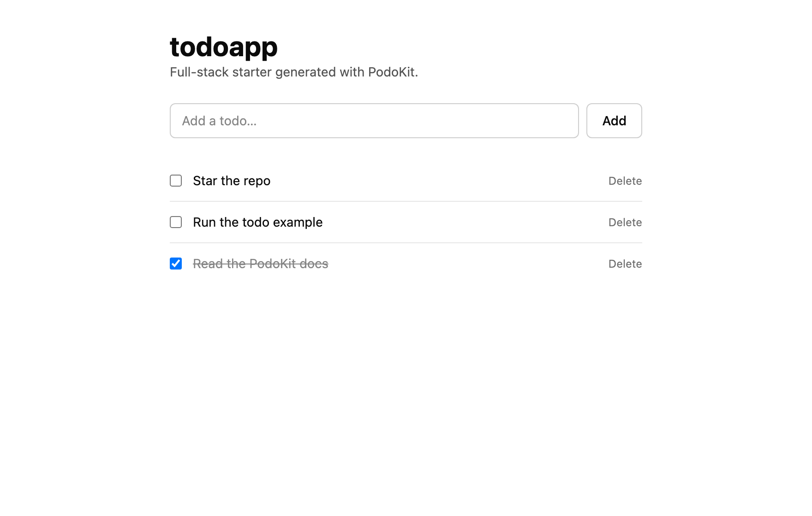
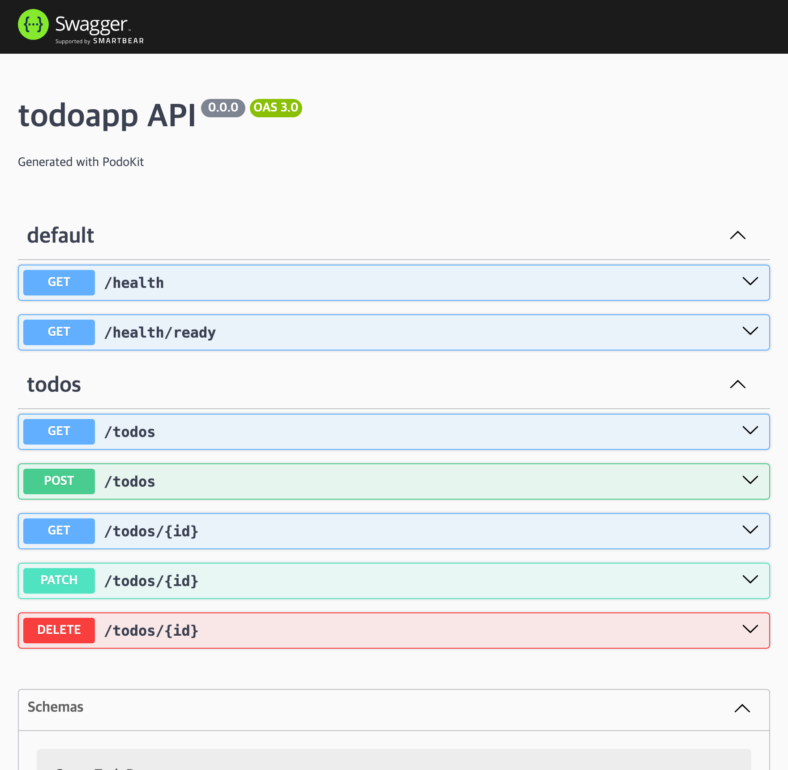
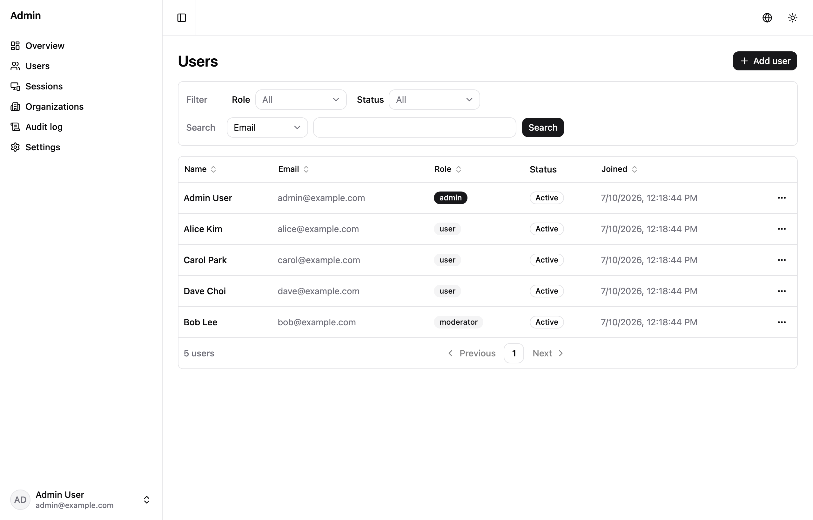
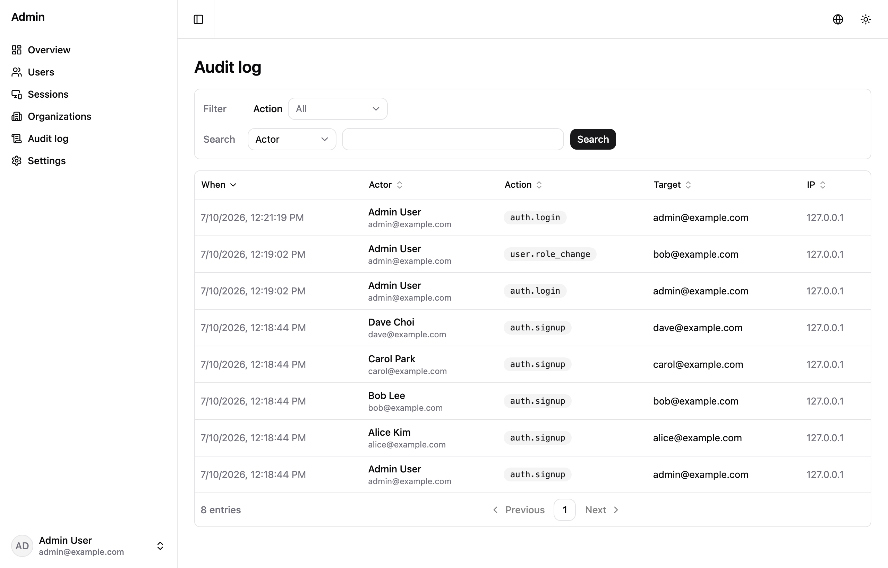
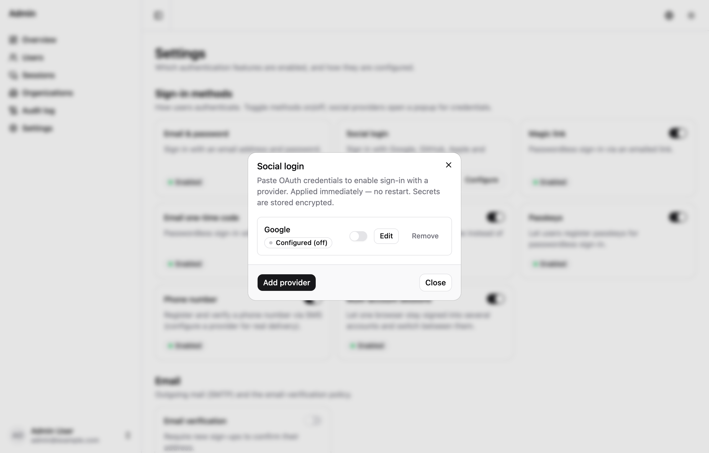

# Generated examples

PodoKit generates examples through the CLI. Applications use Bun 1.4.0,
Elysia, SvelteKit, and native `Bun.SQL`. Start with the
[creation guide](../docs/getting-started.md), then add features to the generated
project. Each example below describes its provider requirements.

## Small Todo app without external services

The `todo` template works with PostgreSQL or SQLite. Use SQLite for a simple
program; memory cache/events, local files, and local jobs let added features run
without PostgreSQL, Redis, or S3:

```bash
bunx --bun @podosoft/podokit create podokit --template todo --database sqlite --yes
cd podokit
bunx --bun @podosoft/podokit provider set cache memory --apply
bunx --bun @podosoft/podokit provider set object-storage local --apply
bunx --bun @podosoft/podokit provider set events memory --apply
bunx --bun @podosoft/podokit provider set jobs local --apply
bun install
cp .env.example .env
bun run --cwd apps/api migration:run
```

For only Todo CRUD, the four optional provider commands can be omitted. SQLite
selection changes only the database; those commands select local implementations
for later features. Run `bun run --cwd apps/api dev` and
`bun run --cwd apps/web dev` in separate terminals, then open
`http://localhost:5001`. API docs are at `http://localhost:5002/api-docs`.

| Web | API docs |
| --- | --- |
|  |  |

The following local examples extend this project. Install modules before
starting the app, merge their new `.env.example` entries into `.env`, install
dependencies, and run migrations. Local providers require one API process.
SQLite, files, and job records persist; memory cache/events reset on restart.
See [Runtime providers](../docs/providers.md) for paths and backup boundaries.

## Authentication

Authentication works with either selected database; it does not require Redis
or S3. Add the auth module, set a stable `BETTER_AUTH_SECRET` in `.env`, then
create both Better Auth and application tables:

```bash
bunx --bun @podosoft/podokit add auth
bun install
# Merge the auth and mailer settings from .env.example into .env first.
bun run --cwd apps/api migrate:all
```

Once the API is running, sign up and call a protected route:

```bash
curl -c cookies.txt -XPOST localhost:5002/api/auth/sign-up/email \
  -H 'content-type: application/json' \
  -d '{"email":"user@example.com","password":"podokit-example-password","name":"PodoKit"}'
curl -b cookies.txt localhost:5002/account/me
```

Application routes require a session by default after installing auth. Health,
OpenAPI, auth endpoints, and explicitly registered public routes remain public.
Manage sign-in methods and feature flags in the admin Settings UI, or use
`auth:configure` for supported configuration automation. See
[Authentication](../docs/modules.md#auth-better-auth) for email, OAuth, and account policies.

## Local file uploads

`file-upload` uses the selected object-storage capability. With `local`, the
CLI installs `object-storage-local`; S3 and Docker are unnecessary:

```bash
bunx --bun @podosoft/podokit add file-upload
bun install
```

Merge `LOCAL_STORAGE_PATH` and upload settings from `.env.example` into `.env`.
Once the API is running, upload a file. Include the session cookie when auth is
installed:

```bash
curl -b cookies.txt -F 'file=@./photo.png' localhost:5002/files
```

The response contains `{ key, url }`. Local storage returns an application-local
URL; S3 returns a presigned URL. Local files default to `./data/files` relative
to the API working directory. See [File uploads](../docs/modules.md#file-upload).

## Local jobs and live progress

The `local` job provider persists records in the selected database and runs its
worker inside the API process. Add progress streaming to compose it with memory
events and SSE:

```bash
bunx --bun @podosoft/podokit add job-progress
bun install
bun run --cwd apps/api migrate:all # auth is installed in this example
```

With this local selection, the CLI adds `jobs-local`, `events-memory`, and `sse`.
No Redis or separate worker is required. Once the API is running:

```bash
curl -N -b cookies.txt localhost:5002/events/stream
```

```bash
# In another terminal:
curl -b cookies.txt -XPOST localhost:5002/progress \
  -H 'content-type: application/json' -d '{"steps":5}'
```

Progress events are delivered inside the single API process. For multi-process
delivery, use Redis events and BullMQ. See
[Job progress](../docs/modules.md#job-progress).

## Admin dashboard on local providers

The dashboard adds authentication, user/session administration, organizations,
audit views, runtime Settings, and account self-service. Profile images use the
selected storage provider, so SQLite and local files are sufficient for a small
single-process installation:

```bash
bunx --bun @podosoft/podokit add admin-dashboard
bun install
```

Merge the module settings into `.env`, set a stable `BETTER_AUTH_SECRET`, and
set `ADMIN_EMAILS=admin@example.com`. Then migrate and bootstrap the first
administrator:

```bash
bun run --cwd apps/api migrate:all
export ADMIN_BOOTSTRAP_EMAIL="admin@example.com"
IFS= read -r -s ADMIN_BOOTSTRAP_PASSWORD && export ADMIN_BOOTSTRAP_PASSWORD
bun run --cwd apps/api admin:bootstrap
unset ADMIN_BOOTSTRAP_PASSWORD
```

After starting the app, sign in at `/login` and open `/admin/users`. Use
`/admin/settings` to configure sign-in methods, OAuth, SMTP, and feature flags.
Bootstrap is idempotent and does not print the password. See
[Admin dashboard](../docs/modules.md#admin-dashboard).

| Users | Audit log | Settings |
| --- | --- | --- |
|  |  |  |

## Server providers for shared infrastructure

For a server app using the defaults, create a separate fullstack project and add
the needed features:

```bash
bunx --bun @podosoft/podokit create podokit --yes
cd podokit
bunx --bun @podosoft/podokit add file-upload
bunx --bun @podosoft/podokit add job-progress
bun install
cp .env.example .env
bunx --bun @podosoft/podokit dev watch
```

Use a different parent directory from the local example. This project selects
PostgreSQL, Redis cache/events, S3, and BullMQ. The container loop enables the
installed Redis, Silo, and worker profiles. Run migrations in a second terminal:

```bash
bunx --bun @podosoft/podokit dev exec api bun run --cwd apps/api migration:run
```

Open `http://podokit.localhost`. The S3 module uses Silo in development with
`STORAGE_PROVIDER=minio`; AWS S3 uses `STORAGE_PROVIDER=aws`. Production
deployment settings are documented in [Deployment](../docs/deployment.md).

## Keep generated examples up to date

Generated apps record their assembly in `.podokit/`. Use `podo provider list` to
inspect selections and `podo update` to preview template/module changes before
applying them. Provider switching changes code and configuration only; it does
not transfer existing database rows, cache keys, objects, or jobs. See
[Updating](../docs/updating.md) and [Runtime providers](../docs/providers.md).
